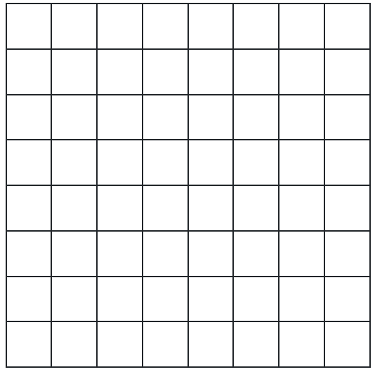

# [Pixel Artifier App](https://estdavid.github.io/pixel-art-app/ "Pixel Artifier App") <a href="https://estdavid.github.io/pixel-art-app/" target="_blank" rel="noreferrer noopener"></a>

The 'Pixel Artifier' app is a Single Page Application app which allows the user to paint on a 'pixel-like' square canvas, which can have the sizes of (8 x 8), (12 x 12), (16 x 16), or (32 x 32) pixels.

You can check out the app at https://estdavid.github.io/pixel-art-app/

<a href="https://estdavid.github.io/pixel-art-app/" target="_blank" rel="noreferrer noopener"></a>

The app is fully responsive and adapts to both smartphone screens and large devices.

Currently, it offers 12 different colors to choose from, and allows the user either paint a single pixel, or 'fill' a group of adjacent pixels which have the same color.

Once the user is happy with the image, they can locally save the image either on .png, .jpg or .gif format. They can also choose whether to keep the grid lines in the saved image or have a grid free picture.

It has been built on JavaScript, using the React library and Bootstrap for the Front End.

# Selected language, libraries and frameworks

## JavaScript

The app uses Javascript as main language. The reason for this choice is mainly because it's the language I have used for building websites. I feel very comfortable with it, and I think it's a very versatile and intuitive language. It also gives you access to very powerful tools and frameworks such as React and Bootstrap.

## React

I chose React as the library on which to build the 'Pixel Artifier' app. I have already built other projects with React, I have obtained quite good results and I have enjoyed a lot the building process.

Apart from this, one of the main things I love about React is how it makes it very easy to create a solid, intuitive structure for a project. At the same time, I find it makes it very easy to reuse code when you properly define generic components, such as buttons or input groups.

I also enjoy the use of JSX, and being able to combine JavaScript with html code. I find it provides a lot of flexbility and enables creativity, especially when you are getting started in coding.

Lastly, I think it combines very well with other powerful tools, such as Boostrap for the frontend, or Redux for managing complex states.

## Bootstrap

Bootstrap represents to me a wonderful tool to easily create professional looking frontends and manage responsivity.

To be honest, I haven't worked with any other CSS frameworks, so I cannot compare. What I have tried sometimes is to just use plain CSS to manage the styling of a website. I find this process quite to be quite time-, as well as mindpower-consuming. At least for me it was very hard to reach my desired goals in terms of layout, style and responsivity just by creating my own CSS rules. I was also very limited in what I thought I could achieve.

Another thing I like about Bootstrap is the extensive and very well structure documentation it provides, it lots of easy to understand examples. Some of these examples are also very good inspiration when it comes to choose which elements to use when building an app.

## 3rd party libraries

### dom-to-image

One of the main 'challenges' for me in this project was to figure out how to translate the html image into an image file. I went through different sets of documentation and tried different libraries until I opted for using the `dom-to-image` library.

The most basic way to generate an image from HTML is to use a `<canvas>` element. The problem is that this element doesn't seem to allow the functionality which was needed for the actual `Canvas` component of this app. It doesn't allow to add to it child components to display pixel-like blocks and manage their color separately with a color matrix.

I tried the `html2canvas` library, but it seemed to render the images with some sort of white border between some pixels.

Finally, I chose `dom-to-image` because it allowed to convert directly the content of the `Canvas` componente into an image with no loss of quality in the rendering of the picture.

# Code structure

## Main folders and files

### `public/` folder
This folder contains the `index.html` file which contains the 'root' `<div>` element from which the React app is run.
It also contains the logo of the app in the form of different icon sizes.

### `src/` folder
The `src/` contains the components of the React app. 

The main files in this folder are:
- `index.js` &rarr; File from which the React app is run. The App component is imported into this file.
- `App.js` &rarr; This file contains the `App` component, which imports and appends to the DOM the main 5 components of the 'Pixel Artifier':
    - Title
    - Canvas
    - Tool Palette
    - Color Palette
    - Actions Palette
- `index.css` &rarr; While most of the styling is done by using bootstrap classes, this .css file contains a few rules to customize some key elements of app's style. The mian font, the color of the brand words and the size of some components are handled by this file.
- `parameters.js` &rarr; This file is used to centralize some basic parameters of the app. It allows to easily add new tools, colors, canvas sizes, image formats or modal dialogs.
- `helpers.js` &rarr; This file centralizes some functions which can be used repeteadly in different parts of the app, such as the `compareColors` function, or take care of specific complex tasks, such as the `fillColor` or the `generateDownloadImage` functions.

 
## Main components and functions

### `Canvas` component

This is the drawing area, where the user can click in order to change the colors of the pixel blocks. It is formed by rows of `Pixel` components.

<center></center>

The color of each pixel is controlled by a color matrix. The initial color matrix is created with two nested for-loops and then the `colorMatrix` variable is initialized with a state hook.

<p class="codeblock-label">Canvas.js</p>

```javascript
    for(let i = 0; i < rows; i+=1) {
        const rowArray = []
        for(let j = 0; j < columns; j+=1) {
            // 
            rowArray.push(backgroundColor)
        }
    initialColorMatrix.push(rowArray)
    }
```

```javascript
    const [colorMatrix, setColorMatrix] = useState(initialColorMatrix)
```

The color data is stored as an RGBA array (Red, Blue, Green, Transparency)

### `Pixel` component

`Pixel` components are simple `<div>` elements with the bootstrap `col` property width set to auto `w-auto`. Their `id` contains the row and the column number and is used to locate the coordinates of the pixel when the user clicks on it.
The color properties are applied directly to the style of the element via props. 
The `onClick` function is handled by the `App` component.

<p class="codeblock-label">Pixel.js</p>

```javascript
    <div
        id={`${rowNumber}-${columnNumber}`}
        className={`col w-auto p-0 m-0 ${showGrid ? 'border border-dark' : null}`}
        style={{
            backgroundColor: "RGBA",
            borderStyle: 'none'
        }}
        onClick={onClick} >
    </div>
```

### `ToolsPalette` component

The `ToolsPalette` component contains the following tools:
- Canvas size menu &rarr; It allows selecting the size in pixels of the image (8 x 8), (12 x 12), (16 x 16), or (32 x 32). If a new size is selected, the current image is erased
- Paint / Fill tool &rarr; It toggles between the `Paint` and the `Fill` functionalities. `Paint` allows to change the color of one pixel at at time, while `Fill` changes the color of the pixel that was clicked and all of those adjacent pixels with the same color.
- Selected color block &rarr; This square block shows the user which color is currently selected.

<center></center>

### `ColorPalette` component
All the colors that can be used in the app are contained as square blocks in this component. The user clicks on a color in order to make it the selected color.

<center></center>

The number and type of colors of this component is controlled by the `colorPalettePure` variable in the `parameters.js` file. Adding more colors or changing the general tones is as simple as updating this array.

<p class="codeblock-label">parameters.js</p>

```javascript
    const colorPalettePure = [
        [255, 255, 255], // White
        [0, 0, 0], // Black
        [192, 0, 0], // Wine Red
        [255, 0, 0], // Red
        [255, 192, 0], // Orange
        [255, 255, 0], // Yellow
        [146, 208, 80], // Light Green
        [0, 176, 80], // Dark Green
        [0, 176, 240], // Sky Blue
        [0, 112, 192], // Ocean Blue
        [0, 32, 96], // Navy Blue
        [112, 48, 160] // Violet
    ]
```

### `Actions Palette` component

This component is used for allowing the user to save the current image or erase it.

<center></center>

Clicking on the `Save Image` button opens a form which allows the user to choose the file format (png, jpg, gif), show/hide the canvas grid, enter the file name and save the current image.

<center></center>

The `Reset Image` button opens a dialog to confirm the action. If the user confirms, the image is erased.

### `fillColor` function

This function is located in the `helpers.js` file and allows the user to paint at once a group of adjacent pixels which have the same color by just clicking on just one of them.

<center></center>

<center></center>

By adjacent, it is assumed that the pixels share one side. Pixels touching each other on a vertex are not considered adjacent.

The function takes the current matrix as input, as well as the new color and the coordinates of the pixel that was clicked.

It makes a copy of the matrix.

<p class="codeblock-label">helpers.js</p>

```javascript
    const newMatrix = [...colorMatrix]
```

It then creates an array which contains another array with the coordinates of the pixel that was clicked.

<p class="codeblock-label">helpers.js</p>

```javascript
    const pixelsToColor = [[row, column]]
```

A while-loop is then started. This loop goes through the content of the pixelsToColor array and only stops when this array is empty `while(pixelsToColor.length > 0)`.

The while-lop first removes the last element in the `pixelsToColor` array and changes the color of this element in the copied color matrix. 

It then enters two nested for-loops which go through the four possible adjacent pixels (above, below, right, left). If these pixels have the same color as the current pixel, they are added to the `pixelsToColor` array.

Once the while-loop is exited, the function returns the copied color matrix.

### `generateDownloadImage` function

This function is located in the `helpers.js` file and handles saving the current color matrix as a file. It takes as input the `Canvas` component, the name of the file and the desired format.

It uses the `toBlob` function from the `dom-to-image` library to generate an image blob, changes the default image format to the selected format, and generates a URL object from image blob.

<p class="codeblock-label">helpers.js</p>

```javascript
toBlob(canvasElement)
    .then(function (imageBlob) {
        imageBlob = imageBlob.slice(0, imageBlob.size, `image/${fileFormat}`)

        const dataUrl = URL.createObjectURL(imageBlob)
        // ...
    })
```

It then generates a link `<a>` element with the name of the file and pointing to the data URL of the image to generate the image file and download it. 

<p class="codeblock-label">helpers.js</p>

```javascript
const link = document.createElement("a")
link.download = `${fileName}.${fileFormat}`
link.href = dataUrl
document.body.appendChild(link)
link.click()
document.body.removeChild(link)
```

## Layout and styling

### Bootstrap setup
Bootstrap v5 is set up by adding the following lines of code to the `index.html` file:

`<link>` element pointing to Bootstrap's `bootstrap.min.css` file at the bottom of the `<head>` element

<p class="codeblock-label">index.html</p>

```html
<link href="https://cdn.jsdelivr.net/npm/bootstrap@5.3.0-alpha1/dist/css/bootstrap.min.css" rel="stylesheet" integrity="sha384-GLhlTQ8iRABdZLl6O3oVMWSktQOp6b7In1Zl3/Jr59b6EGGoI1aFkw7cmDA6j6gD" crossorigin="anonymous">
```

`<script>` element pointing to Bootstrap's `bootstrap.bundle.min.js` file at the bottom of the `<body>` element

<p class="codeblock-label">index.html</p>

```html
<script src="https://cdn.jsdelivr.net/npm/bootstrap@5.3.0-alpha1/dist/js/bootstrap.bundle.min.js" integrity="sha384-w76AqPfDkMBDXo30jS1Sgez6pr3x5MlQ1ZAGC+nuZB+EYdgRZgiwxhTBTkF7CXvN" crossorigin="anonymous"></script>
```

`<link>` element pointing to Bootstrap's `bootstrap-icons.css` icons file at the bottom of the `<head>` element

<p class="codeblock-label">index.html</p>

```html
<link rel="stylesheet" href="https://cdn.jsdelivr.net/npm/bootstrap-icons@1.10.3/font/bootstrap-icons.css">
```

### Page layout

The layout of the page consists of 5 blocks corresponding to the following main components:
- `Title`
- `Canvas`
- `ToolPalette`
- `ColorPalette`
- `ActionsPalette`

The `Title` component sits on top of the other 4 components, using a Bootstrap `navbar`element.

The other 4 elements are included as siblings inside a `d-flex` `<div>` element  using `flex-wrap` to keep the components from overflowing their parent container.

<p class="codeblock-label">App.js</p>

```javascript
<div className="App">
    <Title />
    <div className="container text-center">
        <div className="d-flex flex-wrap justify-content-start">
            <Canvas
            // ...
            />
            <ToolsPalette
            // ...
            />
            <ColorPalette
            // ...
            />
            <ActionsPalette 
            // ...
            />
        </div>
    </div>
</div>
```

The main goal is to display on large devices the image canvas and the tools palette on top, with the color palette directly below the canvas, and the actions palette directly below the tools palette.  

On small devices, the canvas is on top, occupying the whole screen, the color palette and the tools palette switch places, so the colors are still easy to access right below the canvas. The last element on mobile devices is the actions palette.

The width of the main page components is specified with the use of Bootstrap's grid `col` classes: 
- For the components on the left (`Canvas` and `ColorPalette`) the `col-12 col-lg-4` classes is used.
- For the components on the right, `ToolsPalette` uses `col-12 col-lg-6`, while  `ActionsPalette` uses the `col-12 col-lg-4` classes.

# Possible improvements, bugs

## Features to add

The following is a possible 'wish list' of features that would improve the app:
- Possibility to choose the size in real pixels for the saved image
- Add more colors, or even allow the user to choose from different color palettes
- Add basic shapes (squares, circles, rectangles, letters...)
- Possibility to change the color of the background
- Add night / daylight mode button

## Known bugs

The only known bug is this message that is logged to the console.

```
Error while reading CSS rules from https://cdn.jsdelivr.net/npm/bootstrap-icons@1.10.3/font/bootstrap-icons.css SecurityError: CSSStyleSheet.cssRules getter: Not allowed to access cross-origin stylesheet 2 dom-to-image.js:684
```

Apparently, is caused by some undesired interaction between the `dom-to-image` library and the inclusion of Bootstrap's `bootstrap-icons.css` file.

This bug doesn't seem to affect the functionality of the app.